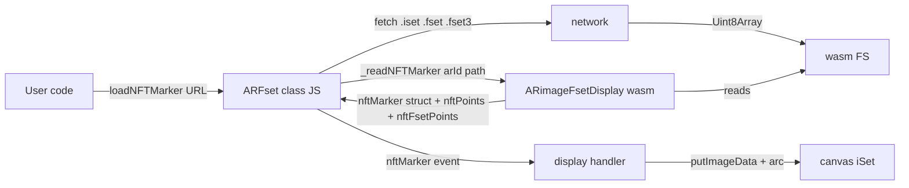

# FeatureSET-Display

> Display the contents of NFT marker files (`.iset`, `.fset`, `.fset3`) — the
> image preview plus the feature points used for detection and tracking — in
> a browser, via WebAssembly.

Useful for inspecting markers generated with
[NFT-Marker-Creator](https://github.com/Carnaux/NFT-Marker-Creator) or [Nft-Marker-Creator-App](https://github.com/webarkit/Nft-Marker-Creator-App) :
see at a glance whether a marker has enough trackable features, whether
they're clustered in a corner, or whether the source image lost
contrast during the dataset build.

---

## What you get

For any marker triplet (`name.iset` + `name.fset` + `name.fset3`),
the library:

- Reads the imageSet preview into an HTML5 canvas.
- Overlays the detection feature points as **light green** circles.
- Overlays the tracking feature points as **small red** circles.
- Logs the marker dimensions, DPI, and feature-point counts to the
  browser console.

## Install

```bash
npm install @webarkit/featureset-display
```

Or load the UMD bundle directly:

```html
<script src="https://unpkg.com/@webarkit/featureset-display"></script>
```

## Quick start (ES module)

```html
<script type="module">
  import ARFsetModule from '@webarkit/featureset-display';

  const ar = new ARFsetModule.ARFset();
  await ar.initialize();
  await ar.loadNFTMarker('path/to/marker'); // no extension
  ar.display();
</script>
```

The library will create a `<canvas id="iSet">` element in the document
body and render the marker preview into it. Use `attachCanvas(id)`
before `initialize()` to mount it inside a specific container instead:

```js
const ar = new ARFsetModule.ARFset();
ar.attachCanvas('my-container');
await ar.initialize();
await ar.loadNFTMarker('path/to/marker');
ar.display();
```

## Quick start (`<script>` tag)

```html
<script src="dist/ARFset.umd.js"></script>
<script>
  const ar = new ARFset.ARFset();
  ar.initialize().then(() => {
    ar.loadNFTMarker('path/to/marker');
    ar.display();
  });
</script>
```

`window.ARFset` resolves to the same default export as the ESM build.

## API

### `new ARFset(options?)`

| Option   | Type   | Default | Description                 |
| -------- | ------ | ------- | --------------------------- |
| `width`  | number | `893`   | Initial wasm canvas width.  |
| `height` | number | `1117`  | Initial wasm canvas height. |

These set the wasm-side initial memory layout. The on-screen canvas is
resized at marker-load time to the actual reported marker dimensions,
so the defaults don't need to match your marker.

### `await ar.initialize()`

Loads the WebAssembly runtime and prepares the canvas. Must be awaited
before anything else.

### `ar.attachCanvas(id)`

Mount the canvas inside an existing DOM element instead of `body`.
Call before `initialize()`.

### `await ar.loadNFTMarker(urlPrefix)`

Fetches `urlPrefix.iset`, `urlPrefix.fset`, and `urlPrefix.fset3`,
loads them into the wasm filesystem, and dispatches an `'nftMarker'`
`CustomEvent` on `document` when ready.

### `await ar.loadNFTMarkerBlob([isetUrl, fset3Url, fsetUrl])`

Same as above but for user-uploaded data — pass an array of three
URLs (or data URLs from `FileReader.readAsDataURL`) in the order
`[iset, fset3, fset]`.

### `ar.display()`

Subscribe to the `'nftMarker'` event and render the marker preview
plus feature-point circles whenever a marker loads.

### Events dispatched on `document`

| Event       | Detail                                                              |
| ----------- | ------------------------------------------------------------------- |
| `nftMarker` | `{ numIset, widthNFT, heightNFT, dpi, numFpoints, nftPoints, ... }` |
| `imageEv`   | (no detail) — fired after the canvas has been painted               |

## How it works



The C++ side ([`emscripten/ARimageFsetDisplay.cpp`](emscripten/ARimageFsetDisplay.cpp))
links against [WebARKitLib](https://github.com/webarkit/WebARKitLib)
(a maintained fork of jsartoolkit5 / ARToolKit5) to parse the
`.iset` / `.fset` / `.fset3` files and extract feature points. The
result is returned through an embind `value_object`, so JS reads the
data directly from the returned struct — no `EM_ASM` side-channel.

## Build from source

Prerequisites:

- Node.js 22+
- [emsdk](https://emscripten.org/docs/getting_started/downloads.html)
  with `EMSDK` set (run `emsdk_env.bat` / `source emsdk_env.sh` once
  per shell).
- Python 3 on `PATH` (needed by `emcc.py` on Windows).
- Git submodules initialised:

  ```bash
  git submodule update --init --recursive
  ```

Then:

```bash
npm install          # devDependencies (vite, vitest, playwright)
npm run build        # wasm bundles -> build/
npm run build-es6    # JS bundle    -> dist/
npm test             # unit tests   (Vitest)
npm run test:e2e     # browser smoke test (Playwright)
```

To try the example locally:

```bash
npm run serve
# open http://localhost:8080/example/example_es6.html
```

## Migration from 0.3.x

`0.4.0` removed the legacy global `window.ARfset` API and the asm.js
build targets.

**Before (0.3.x):**

```html
<script src="build/arfset.min.js"></script>
<script>
  const ar = new ARfset();
  ar.loadNFTMarker('marker', (nft) => { ... });
</script>
```

**After (0.4.x), ESM:**

```html
<script type="module">
  import ARFsetModule from '@webarkit/featureset-display';
  const ar = new ARFsetModule.ARFset();
  await ar.initialize();
  await ar.loadNFTMarker('marker');
  ar.display();
</script>
```

**After (0.4.x), classic script:**

```html
<script src="dist/ARFset.umd.js"></script>
<script>
  const ar = new ARFset.ARFset();
  ar.initialize().then(() => {
    ar.loadNFTMarker('marker');
    ar.display();
  });
</script>
```

Note the new namespace: `window.ARFset` exposes `{ ARFset: class }`,
so the class is reached as `ARFset.ARFset`. The class also requires
an `initialize()` await before `loadNFTMarker`, where the legacy
global used to dispatch a `FeatureSETDisplay-loaded` event instead.

## License

LGPL-3.0 — see [LICENSE.txt](LICENSE.txt).
